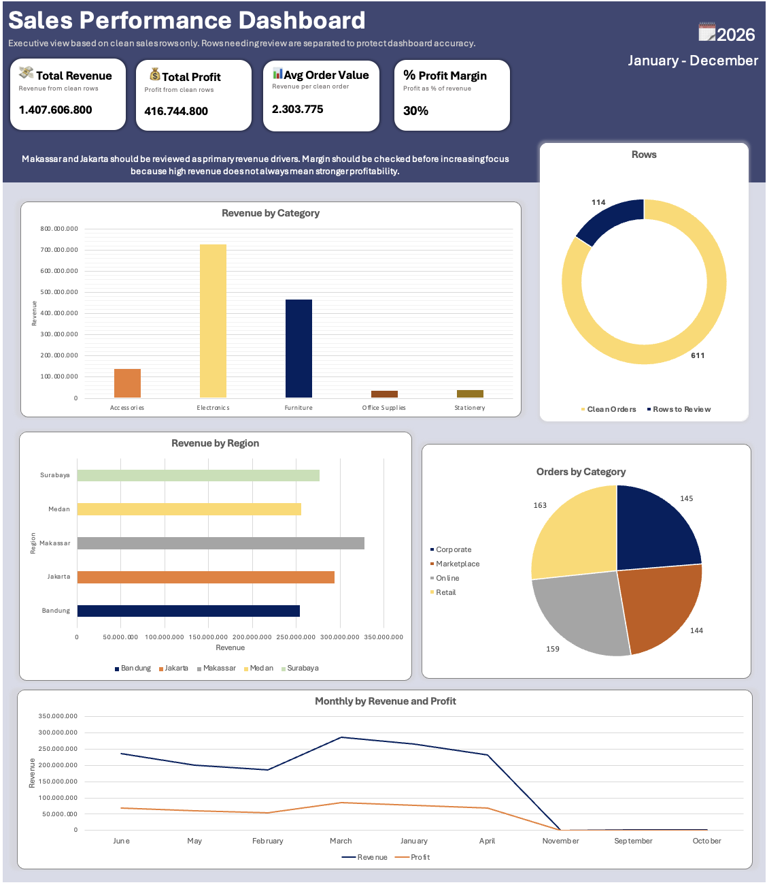

# Sales Performance Analysis

## Project Overview

This project analyzes sales performance data to understand revenue drivers, profit patterns, and regional performance.

## Business Objective

The objective is to identify which product categories, regions, and sales channels contribute the most to clean revenue and profit, while also documenting data quality issues that should be reviewed before making dashboard-based decisions.

## Dataset

The dataset contains order-level sales records with fields such as order date, customer name, region, channel, order status, product, quantity, revenue, cost, profit, and sales representative.

The dataset includes intentional data quality issues such as inconsistent text formatting, date formatting differences, missing values, duplicate order IDs, and some numeric values stored as text.

## Tools Used

- Microsoft Excel
- Power Query
- Excel formulas
- Summary tables
- PivotTable-style analysis
- Excel dashboard
- GitHub documentation

 ## Analysis Process

1. Reviewed raw sales order data and data dictionary.
2. Standardized text fields such as region, channel, status, and category.
3. Converted date and numeric fields into analysis-ready values.
4. Reviewed duplicate orders, missing values, and unusual status records.
5. Built summary analysis for revenue, profit, order count, average order value, and margin.
6. Created a dashboard preview and business insights.

## Key Insights

- Electronics generated the highest clean revenue.
- Stationery had the strongest profit margin.
- Makassar was the strongest region by clean revenue.
- 114 rows required review before being used for dashboard decisions.

## Dashboard Preview

## Files

- `sales-performance-dataset.xlsx`: source dataset used for the project
- `sales-performance-analysis.xlsx`: Excel workbook with cleaned data, summaries, dashboard, and insights
- `dashboard-preview.png`: dashboard preview image
- `data-cleaning-log.md`: business-style cleaning documentation
- `business-insights.md`: summary of key findings and recommendations

## Summary Metrics

| Metric | Value |
|---|---:|
| Clean Revenue | Rp 1.407.606.800 |
| Clean Profit | Rp 416.744.800 |
| Clean Orders | 611 |
